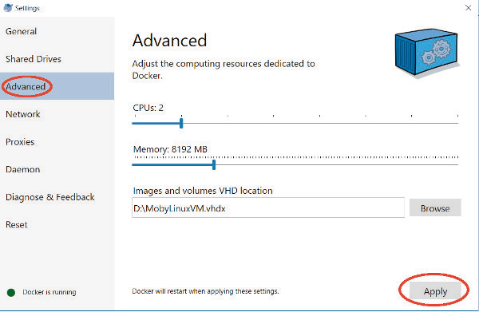

.. Notes and doc on installing ODM

Installation and Getting Started
================================

This section is excerpted and modified with permission from `OpenDroneMap: The Missing Guide <https://odmbook.com>`_, by Piero Toffanin.

Until recently OpenDroneMap was the term used to refer to a single command line application (what is now known as the ODM project).  With the recent development of a web interface, an API and other tools, OpenDroneMap has become an ecosystem of various applications to process, analyze and display aerial data. This ecosystem is made of several components:

.. figure:: https://www.opendronemap.org/wp-content/uploads/2018/07/odm-logo-64x64.png
   :alt: ODM Logo
   :align: center

* **ODM** is the processing engine, which can be used from the command line. It takes images as input and produces a variety of outputs, including point clouds, 3D models and orthophotos

.. figure:: images/NodeODMLogo.png
   :alt: NodeODM Logo
   :align: center

* **NodeODM** is a light-weight API built on top of ODM. It allows users and applications to access the functions of ODM over a computer network

.. figure:: https://www.opendronemap.org/wp-content/uploads/2018/07/webodm-icon-64x64.png
   :alt: WebODM Logo
   :align: center

* **WebODM** is a friendly user interface that includes a map viewer, a 3D viewer, user logins, a plugin system and many other features that are expected of modern drone mapping platforms

.. figure:: https://www.opendronemap.org/wp-content/uploads/2019/01/cloudodm-64x64.png
   :alt: CloudODM Logo
   :align: center

* **CloudODM** is a small command line client to communicate with ODM via the NodeODM API

.. figure:: images/PyODMLogo.png
   :alt: PyODM Logo
   :align: center

* **PyODM** is a Python SDK for creating tasks via the NodeODM API. We cover it in more detail in the “Automated Processing With Python” chapter


* **ClusterODM** is a load balancer for connecting together multiple NodeODM instances

ODM, NodeODM and WebODM are available on all major platforms (Windows, macOS and Linux) via a program called docker, which is required to run the software. Docker offers a way to run “containers”. Containers are packaged copies of an entire system, its software and its dependencies. These containers run within a virtual environment. On Linux this virtual environment is available from the operating system and is very efficient. On macOS and Windows the containers run within a VM, so there’s a bit of a overhead. but it’s still very suitable for running the software. Once installed users do not have to worry much about docker, as it operates (almost) transparently.

Without docker it would not be possible to run ODM on Windows or macOS. On these platforms ODM cannot run natively. Future development efforts are being focused on leveraging the new Windows Subsystem for Linux (WSL) and the possibility to make a native port of all dependencies to macOS, which is going to make the installation much easier.

On Ubuntu Linux 16.04 it’s feasible to run all OpenDroneMap software natively. However, because there’s very little performance penalty for running docker on Linux and docker is straightforward to setup on this platform, we don’t recommend it. On Linux the advantages of containerization far outweigh a tiny performance penalty. With docker users also get easy one-step updates of the software, so that’s nice.


Hardware Recommendations
------------------------

The bare minimum requirements for running the software
are:

* 64bit CPU manufactured on or after 2010
* 20 GB of disk space
* 4 GB RAM

No more than 100-200 images can be processed with the above specifications (the software will run out of memory). Recommended requirements are:

* Latest Generation CPU
* 100 GB of disk space
* 16 GB RAM

The above will allow for a few hundred images to be processed without too many issues. A CPU with more cores will allow for faster processing, while a graphics card (GPU) currently has no impact on performance. For processing more images, add more disk space and RAM linearly to the number of images you need to process.


.. _docker-installation:

Installation
------------

We recommend people use `docker <https://www.docker.com>`_ for running ODM, whether you are on Windows, macOS or Linux.

Windows
```````

To run OpenDroneMap you need at least Windows 7. Previous
versions of Windows are not supported.

Step 1. Check Virtualization Support
^^^^^^^^^^^^^^^^^^^^^^^^^^^^^^^^^^^^

Docker requires a feature from your CPU called virtualization, which allows it to run virtual machines (VMs). Make sure you have it enabled! Sometimes this is disabled. To check, on Windows 8 or higher you can open the **Task Manager** (press CTRL+SHIFT+ESC) and switch to the **Performance** tab.

.. figure:: images/virtualizationcheck.png
   :alt: Image of checking virtualization in Windows 8 or higher
   :align: center

*Virtualization should be enabled*

On Windows 7 to see if you have virtualization enabled you can use the `Microsoft® Hardware-Assisted Virtualization Detection Tool <http://
www.microsoft.com/en-us/download/details.aspx?id=592>`_ instead.

If virtualization is disabled, you’ll need to enable it. The procedure unfortunately is a bit different for each computer model, so the best way to do this is to look up on a search engine “how to enable vtx for <type your computer model here>”. Often times it’s a matter of restarting the computer, immediately pressing F2 or F12 during startup, navigating the boot menu and changing the settings to enable virtualization (often called “VT-X”).

.. figure:: images/bioskeys.png
   :alt: Table of different bios keys
   :align: center

*Common keys to press at computer startup to access the boot menu for various PC vendors*

Step 2. Install Requirements
^^^^^^^^^^^^^^^^^^^^^^^^^^^^

First, you’ll need to install:

* Git: https://git-scm.com/downloads
* Python (latest version 3): https://www.python.org/downloads/windows/

For Python 3, make sure you check **Add Python 3.x to PATH** during the installation.

.. figure:: images/installpython3.png
   :alt: Screenshot of Python3 installation process
   :align: center

*Don’t forget to add the Python executable to your PATH (so that you can run commands with it)*

Then, only if you are on Windows 10 Home, Windows 8 (any version) or Windows 7 (any version), install:

* Docker Toolbox: https://github.com/docker/toolbox/releases/download/v18.09.3/DockerToolbox-18.09.3.exe

If you are on Windows 10 Professional or a newer version, you should install instead:

* Docker for Windows: https://download.docker.com/win/stable/Docker%20for%20Windows%20Installer.exe

Please do **NOT** install both docker programs. They are different and will create a mess if they are both installed.

After installing docker, launch it from the Desktop icon that is created from the installation (**Docker Quickstart** in the case of Docker Toolbox, **Docker for Windows** for Docker for Windows). This is important, do not skip this step. If there are errors, follow the prompts on screen to fix them.

Step 3. Check Memory and CPU Allocation
^^^^^^^^^^^^^^^^^^^^^^^^^^^^^^^^^^^^^^^

Docker on Windows works by running a VM in the background (think of a VM as a “computer emulator”). This VM has a certain amount of memory allocated and WebODM can only use as much memory as it’s allocated.

If you installed Docker Toolbox (see below if you installed Docker for Windows instead):

1. Open the **VirtualBox Manager** application
2. Right click the **default** VM and press **Close (ACPI Shutdown)** to stop the machine
3. Right click the **default** VM and press **Settings...**
4. Move the **Base Memory** slider from the **System** paneland allocate 60-70% of all available memory, optionally adding 50% of the available processors from the **Processor** tab also

.. figure:: images/virtualboxsettings.png
   :alt: Screenshot of VirtualBox Settings
   :align: center

*VirtualBox default VM settings*

Then press **OK**, right click the **default** VM and press **Start**.

If you installed Docker for Windows instead:

1. Look in the system tray and right click the “white whale” icon.
2. From the menu, press **Settings...**
3. From the panel, click **Advanced** and use the sliders to allocate 60-70% of available memory and use half of all available CPUs.
4. Press **Apply**.

.. figure:: images/dockericon.png
   :alt: Screenshot of Docker Icon
   :align: center

*Step 1 Docker icon*



*Step 3 & 4 Docker settings*

Step 4. Download WebODM
^^^^^^^^^^^^^^^^^^^^^^^

Open the **Git Gui** program that comes installed with Git. From there:

* In **Source Location** type: https://github.com/Open-DroneMap/WebODM
* In **Target Directory** click browse and navigate to a folder of your choosing (create one if necessary)
* Press **Clone**

.. figure:: images/gitgui.png
   :alt: Screenshot of Git Gui
   :align: center

*Git Gui*

If the download succeeded, you should now see this window:

.. figure:: images/gitguisuccess.png
   :alt: Screenshot of Git Gui after successful download
   :align: center

*Git Gui after successful download (clone)*

Go to the **Repository** menu, then click **Create Desktop Icon**. This will allow you to come back to this application easily in the future.

Step 4. Launch WebODM
^^^^^^^^^^^^^^^^^^^^^

From Git Gui, go to the **Repository** menu, then click **Git Bash**. From the command line terminal type:

.. code:: bash

	$ ./webodm.sh start&
	
Several components will download to your machine at this point, including WebODM, NodeODM and ODM. After the download you should be greeted by the following screen:

.. figure:: images/webodmsuccess.png
   :alt: Screenshot of after successfully downloading WebODM
   :align: center

*Console output after starting WebODM for the first time*

* If you are using Docker for Windows, open a web browser to http://localhost:8000
* If you are using Docker Toolbox, find the IP address to connect to by typing:

.. code:: bash

	$ docker-machine ip

You should get a result like the following:

.. code:: bash

	192.168.1.100
	
Then connect to http://192.168.1.100:8000 (replacing the IP address with the proper one).

macOS
`````

Most modern (post 2010) Mac computers running macOS Sierra 10.12 or higher can run OpenDroneMap using docker, as long as hardware virtualization is supported (see below).

Step 1. Check Virtualization Support
^^^^^^^^^^^^^^^^^^^^^^^^^^^^^^^^^^^^

Open a Terminal window and type:

.. code:: bash

	$ sysctl kern.hv_support

You will get a response similar to the following:

.. code:: bash

	kern.hv_support: 1

If the result is *kern.hv_support: 1*, then your Mac is supported! Continue with Step 2.

If the result is *kern.hv_support: 0*, unfortunately it means your Mac is too old to run OpenDroneMap. :(

Step 2. Install Requirements
^^^^^^^^^^^^^^^^^^^^^^^^^^^^

There are only two programs to install:

1. Docker: https://download.docker.com/mac/stable/Docker.dmg
2. Git: https://sourceforge.net/projects/git-osx-installer/files/

After installing docker you should find an icon that looks like a whale in the task bar.

.. figure:: images/macwhale.png
   :alt: Screenshot of Docker whale
   :align: center

*Docker app running*

You can verify that docker is running properly by opening the **Terminal** app and typing:

.. code:: bash

	$ docker run hello-world
	
Which should return

.. code:: bash

	Hello from Docker!
	
To verify that git is installed, simply type:

.. code:: bash

	$ git --version
	
Which should return something similar to the following:

.. code:: bash

	git version 2.20.1 (Apple Git-117)
	
If you get a “bash: git: command not found”, try to restart your **Terminal** app and double-check for any errors during the install process.

Step 3. Check Memory and CPU Allocation
^^^^^^^^^^^^^^^^^^^^^^^^^^^^^^^^^^^^^^^

Docker on macOS works by running a VM in the background (think of it as a “computer emulator”). This VM has a certain amount of memory allocated and WebODM can only use as much memory as it’s allocated.

1. Right click the whale icon from the task bar and click **Preferences**...
2. Select the **Advanced** tab
3. Adjust the CPUs slider to use half of all available CPUs and the memory to use 60-70% of all available memory
4. Press **Apply & Restart**

.. figure:: images/dockeradvanced.png
   :alt: Screenshot of Docker advanced settings
   :align: center

*Docker advanced settings*

Step 4. Download and Launch WebODM
^^^^^^^^^^^^^^^^^^^^^^^^^^^^^^^^^^

From a **Terminal** type:

.. code:: bash

	$ git clone https://github.com/OpenDroneMap/WebODM
	$ cd WebODM
	$ ./webodm.sh start

Then open a web browser to http://localhost:8000.

Linux
`````

OpenDroneMap can run on any Linux distribution that supports docker. According to `docker’s documentation website <https://docs.docker.com/install/>`_ the officially supported distributions are CentOS, Debian, Ubuntu and Fedora, with static binaries available for others. If you have to pick a distribution solely for running OpenDroneMap, Ubuntu is the recommended way to go.

Step 1. Install Requirements
^^^^^^^^^^^^^^^^^^^^^^^^^^^^

There are four programs that need to be installed:

1. Docker
2. Git
3. Python (2 or 3)
4. Pip

We cannot possibly cover the installation process for every Linux distribution out there, so we’ll limit the instructions to those that are distributions officially supported by docker. In all cases it’s just a matter of opening a terminal prompt and typing a few commands.

Install on Ubuntu / Debian
__________________________

Commands to type:

.. code:: bash

	$ sudo apt update
	$ curl -fsSL https://get.docker.com -o get-docker.sh
	$ sh get-docker.sh
	$ sudo apt install -y git python python-pip

Install on CentOS / RHEL
________________________

Commands to type:

.. code:: bash

	$ curl -fsSL https://get.docker.com -o get-docker.sh
	$ sh get-docker.sh
	$ sudo yum -y install git python python-pip
	
Install on Fedora
_________________

Commands to type:

.. code:: bash

	$ curl -fsSL https://get.docker.com -o get-docker.sh
	$ sh get-docker.sh
	$ sudo dnf install git python python-pip
	
Install on Arch
_______________

Commands to type:

.. code:: bash

	$ sudo pacman -Sy docker git python python-pip

Step 2. Check Additional Requirements
^^^^^^^^^^^^^^^^^^^^^^^^^^^^^^^^^^^^^

In addition to the three programs above, the dockercompose script is also needed. Sometimes it’s already installed with docker, but sometimes it isn’t. To verify if it’s installed try to type:

.. code:: bash

	$ docker-compose --version
	
You should see somethings similar to the following:

.. code:: bash

	docker-compose version 1.22.0, build f46880f
	
If instead you get something similar to the following:

.. code:: bash

	docker-compose: command not found
	
you can install it by using pip:

.. code:: bash

	$ sudo pip install docker-compose


Step 3. Download and Launch WebODM
^^^^^^^^^^^^^^^^^^^^^^^^^^^^^^^^^^

You may need to use sudo to start the script ./webodm.sh successfully.
From a terminal type:

.. code:: bash

	$ git clone https://github.com/OpenDroneMap/WebODM
	$ cd WebODM
	$ ./webodm.sh start
	
Then open a web browser to http://localhost:8000.

Basic Commands and Troubleshooting
----------------------------------

The cool thing about using docker is that 99% of the tasks you’ll ever need to perform while using WebODM can be done via the ./webodm.sh script. You have already encountered one of them:

.. code:: bash

	$ ./webodm.sh start
	
which takes care of starting WebODM and setting up a default processing node (node-odm-1). If you want to stop WebODM, you can already guess what the command is:

.. code:: bash

	$ ./webodm.sh stop
	
There are several other commands you can use, along with different flags. Flags are parameters passed to the ./webodm.sh command and are typically prefixed with “–”. The **port** flag for example instructs WebODM to use a different network port:

.. code:: bash

	$ ./webodm.sh start --port 80

Other useful commands are listed below:

.. code:: bash

	# Restart WebODM (useful if things get stuck)
	$ ./webodm.sh restart
	
	# Reset the admin user's password if you forget it
	$ ./webodm.sh resetadminpassword newpass
	
	# Update everything to the latest version
	$ ./webodm.sh update
	
	# Store processing results in the specified folder instead of the default location (inside docker)
	$ ./webodm.sh restart --media-dir /path/to/webodm_results

	# See all options
	$ ./webodm.sh --help

`The community forum <https://community.opendronemap.org>`_ is a great place to ask for help if you 	get stuck during any of the installation steps and for general questions on using the ./webodm.sh script.

Hello, WebODM!
--------------

After running ./webodm.sh start and opening WebODM in the browser, you will be greeted with a welcome message and will be asked to create the first user. Take some time to familiarize yourself with the web interface and explore its various menus.

.. figure:: images/webodmdashboard.png
   :alt: Screenshot of WebODM Dashboard
   :align: center

*WebODM Dashboard*

Notice that under the **Processing Nodes** menu there’s a "node-odm-1" node already configured for you to use. This is a NodeODM node and has been created automatically by WebODM. This node is running on the same machine as WebODM.

If you’ve made it this far, congratulations! Now it’s time to start processing some data.


Running on more than one machine
````````````````````````````````

**Optionally:** If you have another computer, you can repeat the installation process (install docker, git, python, etc.) and launch a new NodeODM node by typing from a Terminal/Git Bash window:

.. code:: bash

	docker run --rm -it -p 3000:3000 opendronemap/nodeodm -q 1 --token secret

The above command asks docker to launch a new container using the opendronemap/nodeodm image from Docker Hub (the latest version of NodeODM), using port 3000, setting a maximum number of concurrent tasks to 1 and to protect the node from unauthorized access using the password "secret".

From WebODM you can then press the **Add New** button under **Processing Nodes**. For the **hostname/IP** field type the IP of the second computer. For the **port** field type “3000”. For the **token** field type “secret”. You can also add an optional **label** for your node, such as “second computer”. Then press **Save**.

If everything went well, you should now have two processing nodes! You will be able to process multiple tasks in parallel using two different machines.

`Help edit these docs! <https://github.com/OpenDroneMap/docs/blob/publish/source/installation.rst>`_
