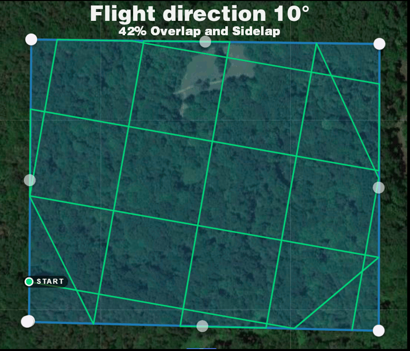
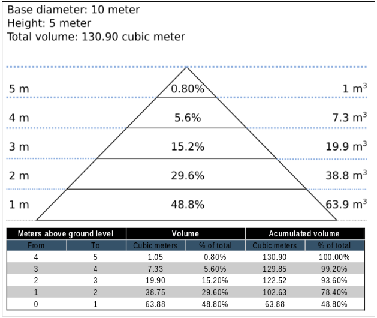
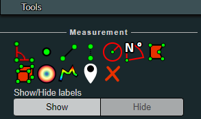
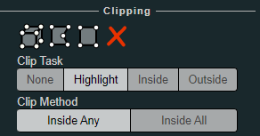
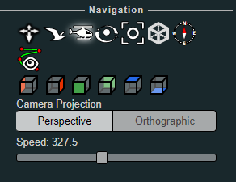

.. Tutorials

#########
Tutorials
#########

Below you will find instructions for some common use cases.

*********************************
Creating High Quality Orthophotos
*********************************

.. figure:: images/orthophoto.png
   :alt: image of OpenDroneMap orthophoto
   :align: center

Without any parameter tweaks, ODM chooses a good compromise between quality, speed and memory usage. If you want to get higher quality results, you need to tweak some parameters:

 * ``--orthophoto-resolution`` is the resolution of the orthophoto in cm/pixel. Decrease this value for a higher resolution result.
 * ``--ignore-gsd`` is a flag that instructs ODM to skip certain memory and speed optimizations that directly affect the orthophoto. Using this flag will increase runtime and memory usage, but may produce sharper results.
 * ``--texturing-data-term`` should be set to `area` in forest areas.
 * ``--mesh-size`` should be increased to ``300000-600000`` and ``--mesh-octree-depth`` should be increased to ``10-11`` in urban areas to recreate better buildings / roofs.

**********************
Calibrating the Camera
**********************

Camera calibration is a special challenge with commodity cameras. Temperature changes, vibrations, focus, and other factors can affect the derived parameters with substantial effects on resulting data. Automatic or self calibration is possible and desirable with drone flights, but depending on the flight pattern, automatic calibration may not remove all distortion from the resulting products. James and Robson (2014) in their paper `Mitigating systematic error in topographic models derived from UAV and ground‐based image networks <https://onlinelibrary.wiley.com/doi/full/10.1002/esp.3609>`_ address how to minimize the distortion from self-calibration.

.. figure:: images/msimbasi_bowling.png
   :alt: image of lens distortion effect on bowling of data
   :align: center

*Bowling effect on point cloud over 13,000+ image dataset collected by World Bank Tanzania over the flood prone Msimbasi Basin, Dar es Salaam, Tanzania.*

To mitigate this effect, there are a few options but the simplest are as follows: fly two patterns separated by 20°, and rather than having a nadir (straight down pointing) camera, use one that tilts forward by 5°.

.. figure:: images/flightplanning.gif
  :alt: animation showing optimum
  :align: center
  :height: 480
  :width: 640

As this approach takes longer than traditional imaging, pilots and teams may apply this technique to a smaller area and use the collected data to optimize future flights. OpenDroneMap can generate a calibration file called cameras.json from a small sample flight. The calibration file can be used for future flights, mitigating the bowling effect without sacrificing efficiency.

Alternatively, the following experimental method can be applied: fly with much lower overlap, but two *crossgrid* flights (sometimes called crosshatch) separated by 20° with a 5° forward facing camera.

* Crossgrid overlap percentages can be lower than parallel flights. To get good 3D results, you will require 68% overlap and sidelap for an equivalent 83% overlap and sidelap.
* To get good 2D and 2.5D (digital elevation model) results, you will require 42% overlap and sidelap for an equivalent 70% overlap and sidelap.

Vertically separated flight lines also improve accuracy, but less so than a camera that is forward facing by 5°.

.. figure:: images/forward_facing.png
   :alt: figure showing effect of vertically separated flight lines and forward facing cameras on improving self calibration
   :align: center

From James and Robson (2014), `CC BY 4.0 <https://creativecommons.org/licenses/by/4.0>`_

*********************************
Creating Digital Elevation Models
*********************************

By default ODM does not create digital elevation models (DEMs). To create a digital terrain model, make sure to pass the ``--dtm`` flag. To create a digital surface model, be sure to pass the ``--dsm`` flag.

.. figure:: images/digitalsurfacemodel.png
   :alt: image of OpenDroneMap derived digital surface model
   :align: center

For DTM generation, a Simple Morphological Filter (smrf) is used to classify points in ground vs. non-ground and only the ground points are used. The ``smrf`` filter can be controlled via several parameters:

 * ``--smrf-scalar`` scaling value. Increase this parameter for terrains with lots of height variation.
 * ``--smrf-slope`` slope parameter, which is a measure of "slope tolerance". Increase this parameter for terrains with lots of height variation. Should be set to something higher than 0.1 and not higher than 1.2.
 * ``--smrf-threshold`` elevation threshold. Set this parameter to the minimum height (in meters) that you expect non-ground objects to be.
 * ``--smrf-window`` window radius parameter (in meters) that corresponds to the size of the largest feature (building, trees, etc.) to be removed. Should be set to a value higher than 10.

Changing these options can affect the result of DTMs significantly. The best source to read to understand how the parameters affect the output is to read the original paper `An improved simple morphological filter for the terrain classification of airborne LIDAR data <https://www.researchgate.net/publication/258333806_An_Improved_Simple_Morphological_Filter_for_the_Terrain_Classification_of_Airborne_LIDAR_Data>`_ (PDF freely available).

Overall the ``--smrf-threshold`` option has the biggest impact on results.

SMRF is good at avoiding Type I errors (small number of ground points mistakenly classified as non-ground) but only "acceptable" at avoiding Type II errors (large number non-ground points mistakenly classified as ground). This needs to be taken in consideration when generating DTMs that are meant to be used visually, since objects mistaken for ground look like artifacts in the final DTM.

.. figure:: images/smrf.png
   :alt: image of lens distortion effect on bowling of data
   :align: center

Two other important parameters affect DEM generation:

 * ``--dem-resolution`` which sets the output resolution of the DEM raster (cm/pixel)
 * ``--dem-gapfill-steps`` which determines the number of progressive DEM layers to use. For urban scenes increasing this value to `4-5` can help produce better interpolation results in the areas that are left empty by the SMRF filter.

Example of how to generate a DTM::

    docker run -ti --rm -v /my/project:/datasets/code <my_odm_image> --project-path /datasets --dtm --dem-resolution 2 --smrf-threshold 0.4 --smrf-window 24

***************************
Measuring stockpile volume
***************************

Fieldwork planning
===================

Weather conditions modify illumination and thus impact the photography results. Best results are obtained with evenly overcast or clear skies. Also look for low wind speeds that allow the camera to remain stable during the data collection process.
In order to avoid shadows which on one side of the stockpile can obstruct feature detection and lessen the number of resulting points, always prefer the flights during the midday, when the sun is at the nadir so everything is consistently illuminated.
Also ensure that your naked eye horizontal visibility distance is congruent with the planned flight distances for the specific project, so image quality is not adversely impacted by dust, fog, smoke, volcanic ash or pollution.

Flight pattern
===============

Most stockpile measurement jobs does not require a crosshatch pattern or angled gimbal as the resting angle of stockpile materials allows the camera to capture the entire stockpile sides. Only some special cases where erosion or machinery operations causes steep angles on the faces of the stockpile would benefit of the crosshatch flight pattern and angled camera gimbal but consider that these additional recognized features come at a cost, (in field labor and processing time) and the resulting improvements are sometimes negligible.

In most of the cases a lawn mower flight pattern is capable of producing highly accurate stockpile models.

.. figure:: images/lawnmower_pattern.png
   :alt: a simple lawnmower flight pattern can produce accurate results
   :align: center

Recommended overlap would be between 75% and 80% with a sidelap in the order of 65% to 70%. It is also recommended to slightly increase overlap and sidelap as the flight height is increased.

Flight height
==============

Flight height can be influenced by different camera models, but in a general way and in order to ensure a balance between image quality and flight optimization, it is recommended to be executed at heights 3 to 4 times the tallest stockpile height. So for a 10 meter stockpile, images can be captured at a height of 40 meters.
As the flight height is increased, it is also recommended to increase overlap, so for a 40 meter height flight you can set a 65% sidelap and 75% overlap, but for a planned height of 80 meters a 70% sidelap and 80% overlap allowing features to be recognized and properly processed.

GCPs
=====

To achieve accuracy levels better than 3%, the use of GCP’s is advised. Typically 5 distributed GCP are sufficient to ensure accurate results.
When placing or measuring GCP, equipment accuracy should be greater than the GSD. Survey grade GNSS and total stations  are intended to provide the required millimetric accuracy.

For further information on the use of GCPs, please refer to the `Ground Control Points section <https://docs.opendronemap.org/gcp/>`_.

Processing parameters
======================

A highly accurate model can be achieved using WebODM high resolution predefined settings. Then you can further adjust some parameters as necessary.

If using ODM, these this reference values can help you configure the process settings.

--dsm: true

--dem-resolution 2.0

--orthophoto-resolution 1.0

--feature-quality high

--pc-quality high

Measuring
==========

As almost 50% of the material will be found in the first 20% of the stockpile height, special care should be taken in adequately defining the base plane.

In WebODM Dashboard, clic on "view map" to start a 2D view of your project.

Once in the 2D map view, clic on the "Measure volume, area and length" button.

.. figure:: images/measurement1.png
   :alt: clic on the "Measure volume, area and length" button
   :align: center

then clic on "Create a new measurement"

.. figure:: images/measurement2.png
   :alt: clic on "Create a new measurement"
   :align: center

Start placing the points to define the stockpile base plane

.. figure:: images/measurement3.png
   :alt: Define the stockpile base plane
   :align: center

Clic on "Finish measurement" to finish the process.

.. figure:: images/measurement4.png
   :alt: Clic on "Finish measurement" to finish the process
   :align: center

Dialog box will show the  message "Computing ..." for a few seconds, and after the computing is finished the volume measurement value will be displayed.

.. figure:: images/measurement7.png
   :alt: Clic on "Finish measurement" to finish the process
   :align: center

If you are using the command line OpenDroneMap you can use the dsm files to measure the stockpile volumes using other programs.

Also consider that once the limits of the stockpile are set in software like `QGis <https://www.qgis.org>`_, you will find there are some ways to determine the base plane. So for isolated stockpiles which boundaries are mostly visible, a linear approach can be used. While for stockpiles set in slopes or in bins, the base plane is better defined by the lowest point.
Creation of a triangulated 3D surface to define the base plane is advised for large stockpiles. This is also valid for stockpiles paced on irregular surfaces.

Expected accuracy
=================

For carefully planned and executed projects, and specially when GSD is less than 1 cm, the expected accuracy should be in the range of 1% to 2%.
The resulting accuracy is comparable to the commercially available photogrammetry software and the obtained using survey grade GNSS equipment.

************
Using Docker
************

Since many users employ docker to deploy OpenDroneMap, it can be useful to understand some basic commands in order to interrogate the docker instances when things go wrong, or we are curious about what is happening. Docker is a containerized environment intended, among other things, to make it easier to deploy software independent of the local environment. In this way, it is similar to virtual machines.

A few simple commands can make our docker experience much better.

Listing Docker Machines
=======================

We can start by listing available docker machines on the current machine we are running as follows:

::

    > docker ps
    CONTAINER ID        IMAGE                  COMMAND                  CREATED             STATUS              PORTS                    NAMES
    2518817537ce        opendronemap/odm       "bash"                   36 hours ago        Up 36 hours                                  zen_wright
    1cdc7fadf688        opendronemap/nodeodm   "/usr/bin/nodejs /va…"   37 hours ago        Up 37 hours         0.0.0.0:3000->3000/tcp   flamboyant_dhawan

If we want to see machines that may not be running but still exist, we can add the `-a` flag:

::

    > docker ps -a
    CONTAINER ID        IMAGE                  COMMAND                  CREATED             STATUS                    PORTS                    NAMES
    2518817537ce        opendronemap/odm       "bash"                   36 hours ago        Up 36 hours                                        zen_wright
    1cdc7fadf688        opendronemap/nodeodm   "/usr/bin/nodejs /va…"   37 hours ago        Up 37 hours               0.0.0.0:3000->3000/tcp   flamboyant_dhawan
    cd7b9585b8f6        opendronemap/odm       "bash"                   3 days ago          Exited (1) 37 hours ago                            nostalgic_lederberg
    e31010c00b9a        opendronemap/odm       "python /code/run.py…"   3 days ago          Exited (2) 3 days ago                              suspicious_kepler
    c44e0d0b8448        opendronemap/nodeodm   "/usr/bin/nodejs /va…"   3 days ago          Exited (0) 37 hours ago                            wonderful_burnell

Accessing logs on the instance
==============================

Using either the `CONTAINER ID` or the name, we can access any logs available on the machine as follows:

::

    > docker logs 2518817537ce

This is likely to be unwieldy large, but we can use a pipe `|` character and other tools to extract just what we need from the logs. For example we can move through the log slowly using the `more` command:

::

    > docker logs 2518817537ce | more
    [INFO]    DTM is turned on, automatically turning on point cloud classification
    [INFO]    Initializing OpenDroneMap app - Mon Sep 23 01:30:33  2019
    [INFO]    ==============
    [INFO]    build_overviews: False
    [INFO]    camera_lens: auto
    [INFO]    crop: 3
    [INFO]    debug: False
    [INFO]    dem_decimation: 1
    [INFO]    dem_euclidean_map: False
    ...

Pressing `Enter` or `Space`, arrow keys or `Page Up` or `Page Down` keys will now help us navigate through the logs. The lower case letter `Q` will let us escape back to the command line.

We can also extract just the end of the logs using the `tail` command as follows:

::

    > docker logs 2518817537ce | tail -5
    [INFO]    Cropping /datasets/code/odm_orthophoto/odm_orthophoto.tif
    [INFO]    running gdalwarp -cutline /datasets/code/odm_georeferencing/odm_georeferenced_model.bounds.gpkg -crop_to_cutline -co NUM_THREADS=8 -co BIGTIFF=IF_SAFER -co BLOCKYSIZE=512 -co COMPRESS=DEFLATE -co BLOCKXSIZE=512 -co TILED=YES -co PREDICTOR=2 /datasets/code/odm_orthophoto/odm_orthophoto.original.tif /datasets/code/odm_orthophoto/odm_orthophoto.tif --config GDAL_CACHEMAX 48.95%
    Using band 4 of source image as alpha.
    Creating output file that is 111567P x 137473L.
    Processing input file /datasets/code/odm_orthophoto/odm_orthophoto.original.tif.

The value `-5` tells the tail command to give us just the last 5 lines of the logs.

Command line access to instances
================================

Sometimes we need to go a little deeper in our exploration of the process for OpenDroneMap. For this, we can get direct command line access to the machines. For this, we can use `docker exec` to execute a `bash` command line shell in the machine of interest as follows:

::

    > docker exec -ti 2518817537ce bash
    root@2518817537ce:/code#

Now we are logged into our docker instance and can explore the machine.

Cleaning up after Docker
========================

Docker has a lamentable use of space and by default does not clean up excess data and machines when processes are complete. This can be advantageous if we need to access a process that has since terminated, but carries the burden of using increasing amounts of storage over time. Maciej Łebkowski has an `excellent overview of how to manage excess disk usage in docker <https://lebkowski.name/docker-volumes/>`_.

*************************************
Using ODM from low-bandwidth location
*************************************

What is this and who is it for?
===============================

Via `Ivan Gayton's repo <https://github.com/ivangayton/GDAL_scripts/>`_.

`OpenDroneMap <https://www.opendronemap.org/>`__ can’t always be
effectively set up locally—it takes a fairly powerful machine to process
large datasets—so a cloud machine can sometimes be the answer for people
in the field. However, bandwidth is a problem in many low-income
settings. This constraint can’t be solved completely, but the following
method does a reasonable job of reducing the bandwidth needed to process
drone imagery datasets on the cloud from African locations.

Here we present a tricky but workable process to create an OpenDroneMap
cloud machine (*not* CloudODM, mind you, just a cloud-based instance of
ODM that you run from the command line) and use it to remotely process
large photo sets. It requires familiarity with Unix command line use,
ssh, a Digital Ocean account (Amazon AWS would work as well, possibly
with slight differences in the setup), and a moderate level of general
computer literacy. If you aren’t fairly computer-savvy and willing to
fuss with a slightly tricky setup,
`CloudODM <https://www.opendronemap.org/cloudodm/>`__ is what you should
be looking at.

The whole process is mostly targeted at someone flying substantial
missions in an African or similar location looking to process data ASAP
while still in a field setting. Therefore it emphasizes a workflow
intended to reduce bandwidth/data transfer, rather than just the
simplest way of running ODM.

Steps
=====

Install
-------

-  Create a Digital Ocean droplet with at least 4GB of RAM. That’ll cost
   about $20/month. Less than 4GB of RAM and the install will probably
   fail. When we actually run the ODM process we’ll resize it to a much
   larger—and more expensive—cloud machine, but between runs you can
   downsize it between runs to the second-cheapest droplet which costs
   only $10/month (the cheapest droplet, at $5/month, comes with such a
   small drive that you can’t downsize back to it).

   -  Should be an Ubuntu 18.04 instance to ensure dependency
      compatibility
   -  Create a user with sudo privileges. `Digital Ocean’s insanely good
      documentation <https://www.digitalocean.com/community/tutorials/initial-server-setup-with-ubuntu-18-04>`__
      can help you figure this out. In our case we set up a user called
      ``odm``, so connecting to it is via the command
      ``ssh odm@xxx.xxx.xxx.xxx`` (where the x’s stand for the IPv4
      address of your server). If you want to follow this example
      closely, *do* use the username ``odm``; then your install path
      will be ``/home/odm/ODM/`` and will match all of the examples in
      this document.
   -  Go ahead and execute ``sudo apt update`` and ``sudo apt upgrade`` to ensure
      your server isn’t dangerously without updates. Make sure to stay with
      Ubuntu 18.04.

-  Download and install ODM on it from the `ODM
   Github <https://github.com/OpenDroneMap/ODM>`__ (regular, not WebODM)
   with the following commands:

::

   git pull https://github.com/OpenDroneMap/ODM.git
   cd ODM
   bash configure.sh install

-  If you do this from the default home folder of your user
   (i.e. ``odm``) the path to the install will be ``/home/odm/ODM``
   (abbreviated as ``~/ODM/``).
-  There are some environmental variables that need to be set. Open the
   ~/.bashrc file on your machine and add the following 3 lines at the
   end (From `the ODM github <https://github.com/OpenDroneMap/ODM>`__).
   The file can be opened with ``nano ~/.bashrc`` (or whatever text
   editor you use in lieu of nano). Be sure to replace ``/home/odm/``
   with the correct path to the location where you extracted
   OpenDroneMap if you didn’t do everything exactly as in our example
   (for example if you used a different username in your server setup):

::

   export PYTHONPATH=$PYTHONPATH:/home/odm/ODM/SuperBuild/install/lib/python2.7/dist-packages
   export PYTHONPATH=$PYTHONPATH:/home/odm/ODM/SuperBuild/src/opensfm
   export LD_LIBRARY_PATH=$LD_LIBRARY_PATH:/home/odm/ODM/SuperBuild/install/lib

-  Note that the ODM github readme contains a slight error, the install
   directory name will be ODM, not OpenDroneMap (you’ll see this if you
   compare the above instructions to the ones on the ODM GitHub).

-  In order to prevent a crash wherein the split-merge process fails to
   locate its own executable, we add the following lines to
   ``~/.bashrc`` (adjust paths if you’ve set things up differently from
   our example):

::

   export PYTHONPATH=$PYTHONPATH:/home/odm/ODM/
   export PATH=$PATH:/home/odm/ODM/

-  Now you’ll need a second cloud hard drive (a “Volume” in Digital
   Ocean jargon) big enough to manage your project. Rule of thumb seems
   to be 10 times the size of your raw image set; we’ve got a 100GB
   image set and set up a 1000GB volume (once the run is done you should
   be able to get rid of most of this expensive drive capacity, but it’s
   needed to complete the process). Set up the volume, attach it to your
   droplet, and `configure its mount
   point <https://www.digitalocean.com/docs/volumes/how-to/mount/>`__
   (in this example we’re setting it to ``/mnt/odmdata/``).

Prep data and project
---------------------

-  Now push your images onto the server. You can use `Secure Copy
   (scp) <https://en.wikipedia.org/wiki/Secure_copy>`__ like so:
   ``scp -r /path/to/my/imagefolder odm@xxx.xxx.xxx.xxx:/mnt/odmdata/``.

   -  This pushes the entire folder full of images (that’s what the
      ``-r`` option does, “recursive”) into the remote location (in our
      example, into the volume we attached to the cloud machine at
      ``/mnt/odmdata/``.
   -  This will take some bandwidth. No way around the size of the
      files.\ `1 <#footnote1>`__, \ `2 <#footnote2>`__\

Directory structure
^^^^^^^^^^^^^^^^^^^

ODM requires the directories on the machine to be set up just so. The
critical bits are the install folder (if you installed as above, it’s
``/home/odm/ODM/``) and the project folder
(i.e. ``/mnt/odmdata/myproject/``)

-  ODM’s settings.yaml file specifies a single parent directory
   containing all projects. This is what goes in the project path line
   of the settings.yaml file (slightly confusingly, this is actually the
   *parent* directory of the individual project directories, which are
   specified by the project name parameter when calling ODM). Edit
   settings.yaml and set the project_path parameter to (as per our
   example setup) ``/mnt/odmdata/``, which in this case points to the
   Volume we created. Individual project directories are created within
   that.
-  Individual project directories, i.e. ``/mnt/odmdata/myproject/``
   contain the gcp_list.txt file, the image_groups.txt file, and the
   images folder for each project.
-  The images folder, i.e. ``/mnt/odmdata/myproject/images/`` contains
   all of the images. If you set it up like this, the images don’t get
   re-copied because they’re already in the directory that ODM wants
   them in.
-  Modify settings.yaml to specify the parent directory of the project
   folder (in this case the Volume we created, ``/mnt/odmdata/``). Make
   sure the images are in the correct spot,
   i.e. ``/mnt/odmdata/myproject/images`` and the other ancillary files
   (gcp_list.txt and image_groups.txt) are in the root folder
   ``/mnt/odmdata/myproject/``
-  if you have the images in separate folders for individual AOI blocks
   or flights (which you will if your flight management was organized),
   you can create an image_groups.txt file with the incantations
   ``for i in *; do cd $i; for j in *; do echo "$j $i" >> ../$i.txt; done; cd ../; done;``
   and ``cd ../``,
   ``for i in myproject/*.txt; do cat $i >> image_groups.txt; done;``.
   That should create a file with the correct structure: a list of all
   image files and a “group name” after each one (which in this case
   will simply be the name of the folder it came from). Then move all of
   the image files into a single directory called images in the project
   root dir (so ``/mnt/odmdata/myproject/images/``). The
   image_groups.txt file will allow ODM to keep track of which images
   belong to the same batch, even though they’re all in a single
   directory.

Resize droplet, pull pin, run away
----------------------------------

-  Shut down and resize your machine to an appropriately monstrous
   number of CPUs and amount of memory. I use the memory-optimized
   machine with 24 dedicated vCPUs and 192GB of RAM (which costs about
   $1.60/hr—which adds up fast, it’s over $1000/month). Restart, and get
   to work quickly so as not to waste expensive big-droplet time.
-  Launch the ODM process via ssh using nohup (so that if you’re cut
   off, processing will continue)

   -  Alternately you can use GNU screen to launch the process from a
      screen session which won’t stop if your connection is interrupted;
      launch ``screen``, and use ``<ctrl> a <ctrl> d`` to detach,
      ``screen -r`` to re-attach. But using screen won’t get you a log
      file of all of the console output unless you do something specific
      to capture that, while nohup gives you a file with all of the
      console output, including error messages, for free.
   -  Note: as of 2020-03 the normal incantation
      ``python run.py -i /path/to/image/folder project_name`` seems
      *not* to work; the ``-i`` or ``--image`` parameter causes a weird
      error. So we drop the -i parameter, and rely on the project
      directory line in the settings.yaml file to direct ODM to the
      right place. Now using (including a split-merge):

::

   nohup python run.py myproject --split 1 --split-overlap 0 --ignore-gsd --depthmap-resolution 1000 --orthophoto-resolution 5 --dem-resolution 15 --pc-las --dsm

-  This points ODM at the folder (in this example)
   ``/mnt/odmdata/myproject/``. Provided the image_groups.txt and
   gcp_list.txt are in this folder, the images are in
   ``/mnt/odmdata/myproject/images/``, and the project path in
   settings.yaml is ``/mnt/odmdata/`` it will not waste time and space
   copying images.

-  Note that this assumes you have an image_groups.txt file. If not,
   this ``-split-overlap 0`` will probably fuck things up, and the
   ``--split 1`` is literally a random number that will be ignored after
   the image_groups.txt file is loaded (I think it normally controls how
   many groups it splits a set of images into, but in our case we’re
   assuming the images are already grouped sensibly). If you don’t have
   a large dataset (>1000 images), omit the ``--split`` and
   ``--split-overlap`` options.

-  Follow the progress using tail (so that you’ll know when it’s done)

::

   tail -f nohup.out

-  You may want to keep an eye on htop (to get a sense of the resource
   usage so that in future you can only spin up a machine as large as
   necessary)

After it finishes (assuming you survive that long)
--------------------------------------------------

-  As soon as processing is done, shut down the machine and resize it
   back down to the inexpensive minimum capacity.
-  Start the machine back up, and log in via ssh.
-  If you want to save download bandwidth, you can compress the
   orthophoto using GDAL. Don’t add overviews, do that on your local
   machine to avoid making the file bigger before downloading it.

::

   gdal_translate -co COMPRESS=JPEG -co PHOTOMETRIC=YCBCR -co TILED=YES -b 1 -b 2 -b 3 -mask 4 --config GDAL_TIFF_INTERNAL_MASK YES /path/to/original/filename.extension /path/to/output.tif

-  Download using scp:
   ``scp odm@xxx.xxx.xxx.xxx:/mnt/odmdata/myproject/odm_orthophoto/odm_orthophoto.tif``
   (or grab the compressed version you created in the last step)

-  Once you get the file on your local computer, you can use QGIS to add
   overviews (“pyramids”) or use the GDAL command
   ``gdaladdo -r average /path/to/image.tif 2 4 8 16 32 64 128 256 512 1024``.

-  You can archive the odm_texturing, odm_georeferencing, and odm-dem
   folders using tar to make them easier to download in one piece (and
   maybe smaller).

::

   tar -zcvf archivename /path/to/folder

***************************************
Using Potree 3D viewer module on WebODM
***************************************

Cameras
=======
Activate this function to display camera positions.

You can also click in the camera icon to display single images in a frame on the upper right corner. A click on the image frame toggles into full screen mode.

Within the image frame there are links to download the image and the GeoJSON camera file.

.. figure:: images/cameras.png
   :alt: Camera locations
   :align: center

Textured model
==============

Activate this function to show load the textured model. Depending on the file size and connection speed, it may take several seconds to load.

.. figure:: images/texturedmodel.png
   :alt: Textured model
   :align: center

Appearance
==========

Point budget
------------
For both appearance and performance purposes, the point budget on the scene can be managed. Some old and less capable machines would benefit from a 500,000 point budget while most mid-range specs machine are capable of handling 1 to 2 million point budget.

A 5 to 7 million point budget produces a smooth point cloud 3d model, but may result in a high resource demanding process.

Default point budget value is set to 1,000,000.

Field of view
-------------

In order to control model elements to be included within the scene the field of view can be adjusted. Default value is set to 60 degrees.

.. figure:: images/FOV_animation.gif
   :alt: Field of view adjustment
   :align: center

Eye Dome-lighting
-----------------

The Potree Point Cloud 3d viewer module can implement eye dome-lighting, a lighting model that accentuates the shapes of objects.

Eye Dome-lighting group objects, shade their outlines and enhances depth perception in scientific visualization images. It is useful for recognition and measurement of structures within a model. It can be modified by adjusting Radius, Strength and Opacity.

By default, Eye Dome-Lighting is enabled on Potree 3D viewer, but it can be disabled by clicking on the enable option.

.. figure:: images/EDL_animation.gif
   :alt: Eye dome lighting adjustment
   :align: center

Background
----------

Potree 3D viewer background can be modified. Available options are **Skybox** / **Gradient** / **Black** / **White** / **None**

.. figure:: images/Background_animation.gif
   :alt: Background selection
   :align: center

Other
-----

**Splat Quality** = Splat quality can be adjusted to standard or high quality, to improve the appearance of the model.

**Min node size** = Min node size option will impact the point density of the nodes represented.

**Box** = Display the boxes of the nodes.

**Lock view** = Lock the point cloud view, preventing to load or unload points to the model.

Tools
=====

Measurement
-----------

Potree 3D viewer module provides several tools for measurement. This tool set consist of 12 elements.
It also has controls for showing or hiding the resulting measurement labels.

Measurements are performed by left clicking on the desired points and for some tools right clicking is needed in order to terminate the process.

**Angle**

This tool measures the tridimensional angle formed by the lines connecting 3 points.
To start a measurement, click on the angle icon, then left click on 3 point and the process will be automatically ended.
Further information can also be obtained from selecting this element under the scene section.

**Point**

This tool highlights a selected point and display its XYZ coordinate.
To start a measurement, click on the point icon, then click on the desired point and the process will be automatically ended.
Further information can also be obtained from selecting this element under the scene section.

**Distance**

This tool measures the tridimensional distance of the lines connecting a series of points.
To start a measurement, click on the distance icon and start clicking on the desired points (two or more). Right click to finish measurement.
Further information such as Total length can also be obtained from selecting this element under the scene section.

**Height**

This tool measures the height or vertical distance between two points.
To start a measurement, click on the height icon and then click on the desired two points. The process will be automatically ended.
Further information can also be obtained from selecting this element under the scene section.

.. figure:: images/height_animation.gif
   :alt: Height measurement
   :align: center

**Circle**

This tool measures the radius of a circle formed by three points.
To start a measurement, click on the circle icon and then click on the desired two points. The process will be automatically ended.
Further information such as Circumference can also be obtained from selecting this element under the scene section.

**Azimuth**

This tool measures the azimuthal angle of a line. This line is formed by two points selected by the user, the angle is measured in degrees, clockwise from 0 to 360 and starting from the geographical north.
To start a measurement, click on the azimuth icon and then click on the desired two points. The process will be automatically ended.
Further information can also be obtained from selecting this element under the scene section.

**Area**

This tool measures the horizontal area formed by a polygon.
To start a measurement, click on the area icon and start clicking on the points forming the desired polygon (three or more). Right click to finish measurement.
Further information can also be obtained from selecting this element under the scene section.

**Volume (cube)**

This tool measures the volume formed by a cube.
To start a measurement, click on the volume (cube) icon and click on the model to place the cube. It is possible relocate, redimension and rotate the cube using the displayed handlers. Right click to finish measurement.
Further information can also be obtained from selecting this element under the scene section.

**Volume (sphere)**

This tool measures the volume formed by a sphere.
To start a measurement, click on the volume (sphere) icon and click on the model to place the sphere. It is possible relocate, redimension and rotate the sphere using the displayed handlers. Right click to finish measurement.
Further information can also be obtained from selecting this element under the scene section.

**Height profile**

This tool creates a height profile formed by a line on the model.
To start a measurement, click on the Height profile icon and then form a line on the model by clicking on the desired points (two or more). Right click to finish measurement.
Further information and options, such as "Show 2d Profile", can also been obtained from selecting this element under the scene section.

.. figure:: images/height_profile.png
   :alt: Height profile
   :align: center

**Annotation**

This tool creates an annotation label on a highlighted point on the model.
To start a measurement, click on the annotation icon and then click on the desired point. The process will be automatically ended.
To edit the annotation, select this element under the scene section, then edit Title and Description.

**Remove measurements**

This tool removes all measurements on the model.
To remove all measurement, click on the "Remove measurements" icon.

Clipping
---------

Point cloud can be clipped by selecting an area. Clipping options include **None** / **Highlight** / **Inside** / **Outside**

To clip a point cloud, click on the volume clip icon, place the cube on the model and relocate, redimension and rotate to contain the desired area.
Highlight is set by default as the clipping method. If display only the points contained within the cube click on "Inside", otherwise click on "Outside".

To remove the clipping volume or polygons click on the "Remove all measurements" icon.

.. figure:: images/clipping_animation.gif
   :alt: Tools - Clipping
   :align: center

Navigation
-----------

Potree 3D viewer have 4 Navigation controls which define its behavior.

**Earth Control**

Earth control navigated as anchored to the ground. Mouse left button moves the model horizontally, mouse wheel controls zoom and right button orbits the model.

**Fly control**

Fly control moves the camera as in birds eye using the keyboard. Keys "W" and "S" moves forward and backwards, respectively and in the direction of the camera, while "A" and "D" moves left and right respectively. Also, the "R" and "F" keys moves the camera up and down. The mouse left button changes the direction of the camera, mouse wheel controls zoom, and right button moves the camera in the XYZ axis.

The speed for these movements can be controlled using the sliding control.

**Helicopter control**

Helicopter control moves the camera as in an aircraft using the keyboard. Keys "W" and "S" moves forward and backwards, respectively restricted in a horizontal plane, while "A" and "D" moves left and right respectively. Also, the "R" and "F" keys moves the camera up and down. The mouse left button changes the direction of the camera, mouse wheel controls zoom, and right button moves the model in the XY axis.

The speed for these movements can be controlled using the sliding control.

**Orbit Control**

Orbit Control is the default navigation behavior. The mouse left button orbits the model, the wheel controls zoom and the right button moves the model in the XYZ axis.

**Full extent**

Full extent button restores the model view.

**Navigation cube**

Navigation cube displays a wireframe cube containing the model.

**Compass**

Compass button displays a compass on the upper right corner.

**Camera animation**

The camera animation button creates a camera animation path. Position of the camera is defined by the points on the green line while the points in the blue line are the location towards the camera is intended to be facing.

To create an animation, adjust the points for the camera locations and camera direction, then select the camera element under the Scene section to create more point, change animation speed or play the animation.

.. figure:: images/camera_animation.gif
   :alt: Tools - Navigation controls
   :align: center

Scene
=====

The Scene section displays a file tree containing all the scene elements.
Elements are arranged in six groups, which are **Point clouds** / **Measurements** / **Annotations**
/ **Other** / **Vector** / **Images**

Each element under these groups can be selected to get further information or to control its properties.

For instance, point clouds properties can be modified to show elevation and also the color ramp cam be customized.

.. figure:: images/pointcloud_elevation.png
   :alt: Tools - Navigation controls
   :align: center

`Learn to edit <https://github.com/opendronemap/docs#how-to-make-your-first-contribution>`_ and help improve `this page <https://github.com/OpenDroneMap/docs/blob/publish/source/tutorials.rst>`_!

********
Advanced
********

Multi-temporal Datasets
=======================

When previously mapped sites need revisited, OpenDroneMap can align multiple versions of a dataset through time by using a prior point cloud or digital elevation model. As the prior point cloud `seems to provide better results <https://community.opendronemap.org/t/tips-to-increase-same-site-temporal-consistency/22161/7>`_, that is the approach we will review here.

Workflow for multi-temporal datasets:
-------------------------------------

.. [#] Process your original data. This step doesn't require a ground control point file, but use one if absolute accuracy is a project requirement
.. [#] Download the Point Cloud from your first processed dataset as an LAZ file type (default). Rename the point cloud to align.laz
.. [#] Include that LAZ file with each of your subsequent processing. If you are using command line ODM, include it in the images directory. If uploading, simply upload with your raw images for processing
.. [#] Check your log. It should include a line near the top that indicates it has set align to a path value, something like this:

    [INFO]    Initializing ODM 3.5.3 - Tue Oct 15 05:01:43  2024
    [INFO]    ==============
    [INFO]    3d_tiles: False
    [INFO]    align: /var/www/data/bc14fa2c-ba5c-4b85-99b0-0b7ff715b210/gcp/align.laz
    [INFO]    auto_boundary: True

Using Singularity
=================

`Singularity <https://sylabs.io/>`__ is another container platform able to run Docker images. 
Singularity can be run both on local machins and in instances where the user does not have root access. 
Instances where a user may not have root privlidges include HPC clusters and cloud cluster resources.
A container is a single file without anything else to install.

Build Singularity image from Docker image
-----------------------------------------

Singularity can use Docker image to build SIF image.

For latest ODM Docker image (Recommended) :

.. code:: bash

   singularity build --disable-cache -f odm_latest.sif docker://opendronemap/odm:latest

For latest ODM GPU Docker image :

.. code:: bash
   
   singularity build --disable-cache -f odm_gpu.sif docker://opendronemap/odm:gpu

Using Singularity SIF image
---------------------------

Once you have used one of the above commands to download and create the `odm_latest.sif` image, it can be ran using singularity. 
Place your images in a directory named “images” (for example /my/project/images) , then simply run :

.. code:: bash

   singularity run --bind /my/project:/datasets/code odm_latest.sif --project-path /datasets

Like with docker, additional `Options and Flags <https://docs.opendronemap.org/arguments/>`_ can be added to the command :

.. code:: bash

   singularity run --bind /my/project:/datasets/code \
   --writable-tmpfs odm_latest.sif \
   --orthophoto-png --mesh-octree-depth 12 --ignore-gsd --dtm \
   --smrf-threshold 0.4 --smrf-window 24 --dsm --pc-csv --pc-las --orthophoto-kmz \
   --ignore-gsd --matcher-type flann --feature-quality ultra --max-concurrency 16 \
   --use-hybrid-bundle-adjustment --build-overviews --time --min-num-features 10000 \
   --project-path /datasets

ClusterODM, NodeODM, SLURM, with Singularity on HPC
===================================================

You can write a SLURM script to schedule and set up available nodes with NodeODM for the ClusterODM to be wired to if you are on the HPC. Using SLURM will decrease the amount of time and processes needed to set up nodes for ClusterODM each time. This provides an easier way for user to use ODM on the HPC.

To setup HPC with SLURM, you must make sure SLURM is installed.

SLURM script will be different from cluster to cluster, depending on which nodes in the cluster that you have. However, the main idea is we want to run NodeODM on each node once, and by default, each NodeODM will be running on port 3000. Apptainer will be taking available ports starting from port 3000, so if your node's port 3000 is open, by default NodeODM will be run on that node. After that, we want to run ClusterODM on the head node and connect the running NodeODMs to the ClusterODM. With that, we will have a functional ClusterODM running on HPC.

Here is an example of SLURM script assigning nodes 48, 50, 51 to run NodeODM. You can freely change and use it depending on your system:

::

	#!/usr/bin/bash
	#source. bashrc
	#SBATCH --partition=8core
	#SBATCH --nodelist-node [48,50, 51]
	#SBATCH --time 20:00:00

	cd SHOME
	cd ODM/NodeODM/

	#Launch on Node 48
	srun --nodes-1 apptainer run --writable node/ &

	#Launch on node 50
	srun --nodes-1 apptainer run --writable node/ &

	#Launch on node 51
	srun --nodes=1 apptainer run --writable node/ &
	wait

You can check for available nodes using sinfo:

::

	sinfo

Run the following command to schedule using the SLURM script:

::

	sbatch sample.slurm

You can also check for currently running jobs using squeue:

::

	squeue -u $USER

Unfortunately, SLURM does not handle assigning jobs to the head node. Hence, if we want to run ClusterODM on the head node, we have to run it locally. After that, you can connect to the CLI and wire the NodeODMs to the ClusterODMs. Here is an example following the sample SLURM script:

::

	telnet localhost 8080
	> NODE ADD node48 3000
	> NODE ADD node50 3000
	> NODE ADD node51 3000
	> NODE LIST

You should always check to make sure which ports are being used to run NodeODM if ClusterODM is not wired correctly.

It is also possible to pre-populate nodes using JSON. If starting ClusterODM from apptainer or docker, the relevant JSON is available at `docker/data/nodes.json`. Contents might look similar to the following:

::

	[
		{"hostname":"node48","port":"3000","token":""},
		{"hostname":"node50","port":"3000","token":""},
		{"hostname":"node51","port":"3000","token":""}
	]

After finish hosting ClusterODM on the head node and finish wiring it to the NodeODM, you can try tunneling to see if ClusterODM works as expected. Open another shell window in your local machine and tunnel them to the HPC using the following command:

::

	ssh -L localhost:10000:localhost:10000 user@hostname

Replace user and hostname with your appropriate username and the hpc address. Basically, this command will tunnel the port of the hpc to your local port. After this, open a browser in your local machine and connect to `http://localhost:10000`. Port 10000 is where ClusterODM's administrative web interface is hosted at. This is what it looks like:

.. figure:: https://user-images.githubusercontent.com/70782465/214938402-707bee90-ea17-4573-82f8-74096d9caf03.png
   :alt: Screenshot of ClusterODM's administrative web interface
   :align: center

Here you can check the NodeODMs status and even add or delete working nodes.

After that, do tunneling for port 3000 of the HPC to your local machine:

::

ssh -L localhost:3000:localhost:3000 user@hostname

Port 3000 is ClusterODM's proxy. This is the place we assign tasks to ClusterODM. Once again, connect to `http://localhost:3000` with your browser after tunneling. Here, you can Assign Tasks and observe the tasks' processes.

.. figure:: https://user-images.githubusercontent.com/70782465/214938234-113f99dc-f69e-4e78-a782-deaf94e986b0.png
   :alt: Screenshot of ClusterODM's jobs interface
   :align: center

After adding images in this browser, you can press Start Task and see ClusterODM assigning tasks to the nodes you have wired to. Go for a walk and check the progress.

Development and testing of ODM
==============================

Development and testing of code changes can be difficult. The simplest way to do so is modify the code and rebuild docker images from source, much as documented in the `README for the ODM repository <https://github.com/OpenDroneMap/ODM?tab=readme-ov-file#build-docker-images-from-source>`_.

However, having to do a full docker rebuild for each change is time consuming and wasteful. What might be better is to have a dedicated, long running node that allows us to test out changes in near real time.

#. Fork and clone repository
#. Set up local NodeODM docker instance
#. Modify code
#. Connect to NodeODM instance
#. Install and use changes

Fork and clone repository
-------------------------

First, let's fork the ODM repo, and checkout a new branch locally that will function as our development branch.

::

	git checkout -b my_clever_new_change
	# Switched to a new branch 'my_clever_new_change'

Set up local NodeODM docker instance
------------------------------------

Next, we will set up a NodeODM instance with a locally mounted volume that points to our development branch of ODM

::

	docker run -d --restart unless-stopped -p 3000:3000 -v /path/to/cloned/ODM/repository/data:/code opendronemap/nodeodm

Modify code
-----------

For our test today, we will attempt to upgrade Ceres Solver to version 2.2.0. Most external libraries like Ceres can be found in the Superbuild directory. In this case we edit SuperBuild/cmake/External-Ceres.cmake, and set it to use version 2.2.0

.. figure:: images/vimdiff_ceres_change.png

Now that we've made that small, but substantive change, we need to rebuild Ceres on the docker image for testing.

Connect to NodeODM instance
---------------------------

Let us find out our container name, in case we forgot:

::

	docker ps
	CONTAINER ID   IMAGE                        COMMAND                  CREATED         STATUS         PORTS                                       NAMES
	c997a4c5611b   opendronemap/nodeodm         "/usr/bin/node /var/…"   2 minutes ago   Up 2 minutes   0.0.0.0:3000->3000/tcp, :::3000->3000/tcp   affectionate_yalow

Now that we know the container name, we will connect to that instance using docker exec as follows:

::

	docker exec -it affectionate_yalow bash

Install and use changes
-----------------------

Let us get the environment prepared for our testing:

::

	root@c997a4c5611b:/var/www# cd /code
	./configure.sh installruntimedepsonly
	mkdir /code/SuperBuild/build
	cd /code/SuperBuild/build

Next we can rebuild Ceres.

::

	cmake ../.
	make -j$(nproc) ceres
		...
	-- Up-to-date: /code/SuperBuild/install/include/ceres
	-- Up-to-date: /code/SuperBuild/install/include/ceres/internal
	-- Installing: /code/SuperBuild/install/include/ceres/internal/config.h
	-- Installing: /code/SuperBuild/install/include/ceres/internal/export.h
	-- Installing: /code/SuperBuild/install/include/ceres/internal/miniglog/glog/logging.h
	-- Installing: /code/SuperBuild/install/lib/cmake/Ceres/CeresTargets.cmake
	-- Installing: /code/SuperBuild/install/lib/cmake/Ceres/CeresTargets-release.cmake
	-- Installing: /code/SuperBuild/install/lib/cmake/Ceres/CeresConfig.cmake
	-- Installing: /code/SuperBuild/install/lib/cmake/Ceres/CeresConfigVersion.cmake
	[100%] Completed 'ceres'
	[100%] Built target ceres

Success! Now we can either run ODM directly inside this container, use the NodeODM interface to process data, or connect in with WebODM for additional testing.
